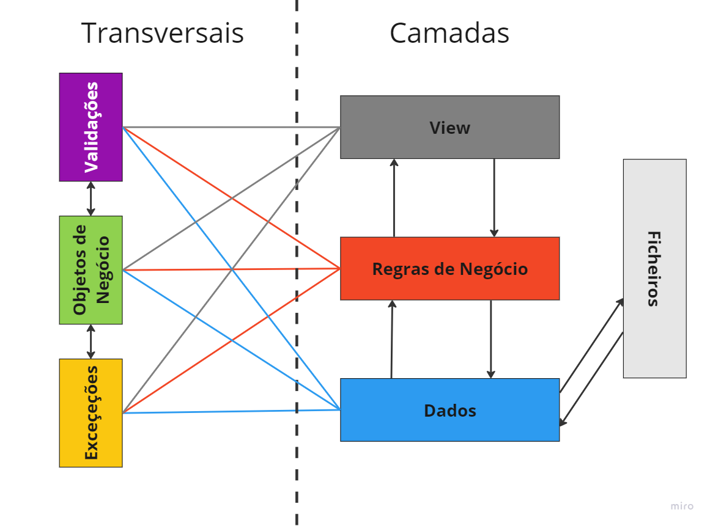

# ProjetoPOO_27985

Bem-vindo ao repositório do projeto desenvolvido no âmbito da unidade curricular **Programação Orientada a Objetos (POO)** do curso de **Engenharia de Sistemas Informáticos** no **IPCA-EST**.

## 👨‍💻 Autor

- **Nome:** Gonçalo Santos  
- **Número:** 27985  
- **Professor:** Luís Gonzaga Martins Ferreira  
- **Unidade Curricular:** Programação Orientada a Objetos  
- **Ano Letivo:** 2024/2025

---

## 📋 Sobre o Projeto

Este projeto consiste no desenvolvimento de um sistema de gestão para um Centro de Saúde, explorando conceitos fundamentais de programação orientada a objetos, como:
- **Encapsulamento**
- **Herança**
- **Polimorfismo**
- **Modularidade**
- **SOLID**

O projeto foi implementado utilizando a linguagem **C#** e inclui a aplicação de metodologias como **N-Tier** e **boas práticas de design de software**.

---

## 🚀 Funcionalidades

- Registo e gestão de:
  - Médicos
  - Consultas
- Validação rigorosa de dados com mensagens de erro claras.
- Sistema de **Logs** para registo de exceções e erros ocorridos durante a execução.
- Estrutura modular para fácil expansão e manutenção.

---

## 🛠️ Tecnologias Utilizadas

- **Linguagem:** C#
- **Cadeira:** Programação Orientada a Objetos
- **Ferramentas de Desenvolvimento:** Visual Studio
- **Controle de Versão:** Git
- **Gestão de Bibliotecas:** DLLs personalizadas
- **Documentação:** Doxygen

---

## 📚 Estrutura do Repositório
├── ProjectPOO/  
│ ├── src/Projeto/ProjetoComAsMinhasCamadas/MinhasCamadas # Código-fonte principal  
│ ├── Documentacao/ # Documentação do projeto  
│ ├── Relatório/Relatório.pdf # Relatório do projeto 
│ ├── ComoCriarDLLs # Recurso em Video 
│ ├── esquema.png # Recurso em png 
│ └── README.md # Este ficheiro 

---

## 🖥️ Demonstração

### Camadas do Projeto

### Logs de Erros
[19/12/2024 16:15:54] [Tipo: ListaConsultaException] [Código: -115] [Mensagem: A data do Início está dentro do intervalo de outra consulta]

---

## 📝 Referências

- [Guia de Estilos de Arquitetura N-Tier](https://learn.microsoft.com/pt-pt/azure/architecture/guide/architecture-styles/n-tier)
- [GitHub do Professor Luís Ferreira](https://github.com/luferIPCA/LESI-POO-2024-2025)
- [Documentação sobre listas em C#](https://learn.microsoft.com/pt-pt/dotnet/csharp/tour-of-csharp/tutorials/arrays-and-collections)
